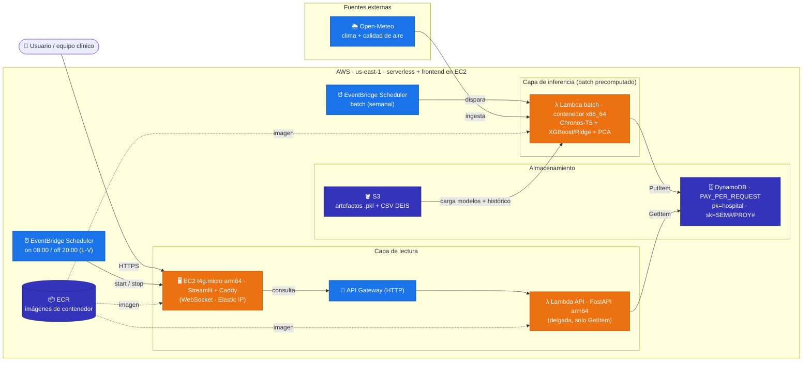
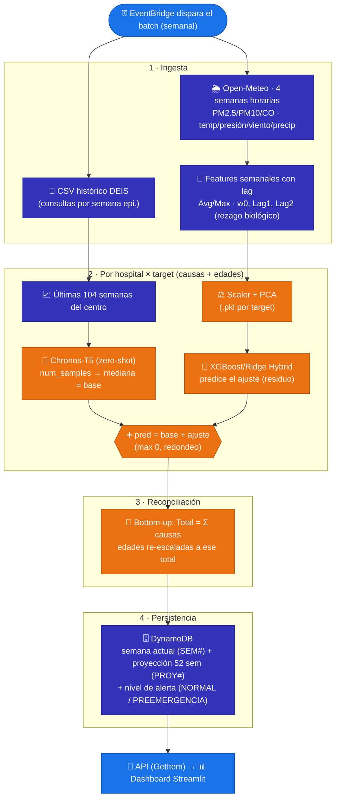
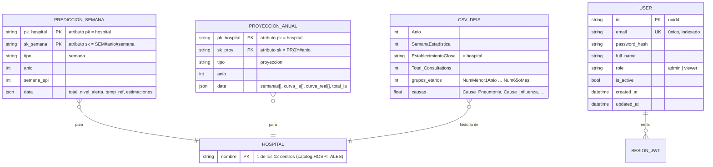

# KIM-NEYÜN

Plataforma de IA que estima consultas de urgencia respiratoria por **semana
epidemiológica** para 12 centros de Temuco / Padre Las Casas (Chile), combinando
**Chronos-T5** (serie de tiempo, zero-shot) con una capa de **corrección de
residuos ML** (XGBoost/Ridge + PCA) alimentada por estresores ambientales con
rezago biológico (arquitectura **HZF**).

Este repo lleva el prototipo del investigador (`poc/`, pensado para Hugging Face)
a una **versión productiva en AWS**, con inferencia **batch precomputada**.

> 📌 Estado, decisiones y handoff completo: **[`CHECKPOINT.md`](CHECKPOINT.md)**.
> Infra: **[`infra/README.md`](infra/README.md)**.

## Arquitectura (resumen)

Una **Lambda batch programada** corre Chronos + ML para los 12 centros y guarda
las predicciones en **DynamoDB**. Una **API delgada (Lambda + API Gateway,
FastAPI)** solo lee la BD, y el **dashboard (Streamlit en EC2 `t4g.micro` +
Caddy)** la consume. Serverless salvo el frontend, que va en EC2 porque App
Runner no soporta WebSocket (lo requiere Streamlit); un **EventBridge Scheduler**
lo enciende/apaga en horario laboral para ahorrar. Región `us-east-1`.
Costo estimado **~US$13–15/mes** (detalle en [`infra/README.md`](infra/README.md#costos)).



### Flujo end-to-end del modelo (HZF)

Qué ocurre **dentro de la Lambda batch** cada vez que corre: por cada uno de los
12 centros y cada *target* (causas + grupos etarios), Chronos-T5 genera la
trayectoria base *zero-shot* y la capa ML corrige el residuo con los estresores
ambientales; luego se reconcilia (bottom-up) y se persiste en DynamoDB para que
la API/dashboard solo lean.



> El modo **táctico** (1 semana) usa el flujo híbrido completo; el modo
> **estratégico** (proyección 52 semanas) usa solo la base Chronos, porque no hay
> pronóstico ambiental a un año. Si faltan los `.pkl` de un target, ese opera en
> **modo zero-shot puro** (sin la corrección ML).

## Estructura

```
poc/          Prototipo original del investigador (referencia, no se despliega)
app/
  shared/     Catálogo, config, acceso a BD, repositorio, schema.sql
  inference/  Lambda batch: Chronos + ML (engine.py), ingesta (ingest.py), run_batch.py, handler.py
  api/        FastAPI delgada (Lambda) — lee DynamoDB
  frontend/   Dashboard Streamlit (EC2 + Caddy)
infra/        Terraform (DynamoDB, S3, ECR, Lambda API+batch, API GW, EventBridge, EC2 frontend, Aurora auth)
models/       (vacío) aquí van los .pkl entrenados
data/         (vacío) aquí va el CSV histórico DEIS
docker-compose.yml   Entorno local
Makefile             Atajos
```

## Modelo de datos

El sistema usa **dos almacenes con propósitos distintos** y un **CSV de entrada**:

- **DynamoDB** (`kim-neyun-predicciones`) — resultados de inferencia precomputados
  que la API solo lee. Tabla única, *PAY_PER_REQUEST*, acceso por clave (sin scans).
- **Postgres / Aurora Serverless v2** (`users`) — autenticación (JWT). Local con
  Postgres; en AWS con Aurora vía Data API (el Lambda no entra a la VPC).
- **CSV histórico DEIS** (`data/…csv`) — fuente de la serie de tiempo que alimenta
  el batch; no es una BD, se carga en memoria por el job de inferencia.



### DynamoDB · `kim-neyun-predicciones`

Tabla única con dos clases de ítem distinguidas por el prefijo del *sort key*. El
payload variable va serializado como JSON en el atributo `data` para evitar
problemas de tipos (`Decimal`/`float`) y conservar el mismo *shape* del PoC.

| Ítem | `pk` | `sk` | Atributos | `data` (JSON) |
|------|------|------|-----------|---------------|
| Predicción semanal (táctico) | `<hospital>` | `SEM#<anio>#<semana>` | `tipo="semana"`, `anio`, `semana_epi` | `total`, `nivel_alerta`, `temp_ref`, `estimaciones` |
| Proyección anual (estratégico) | `<hospital>` | `PROY#<anio>` | `tipo="proyeccion"`, `anio` | `semanas[]`, `curva_ia[]`, `curva_real[]`, `total_ia` |

- **`estimaciones`** = `{ "Causas": {<causa>: int}, "Edades": {<grupo>: int}, "Total": int }`.
- **`nivel_alerta`** ∈ `NORMAL` · `MODERADO` · `CRITICO` (umbral por percentiles del
  histórico de cada centro; ver `app/shared/alertas.py`).
- **`curva_real`** puede traer `null` en semanas sin dato histórico.

Acceso típico (sin scans): `GetItem(pk=hospital, sk="SEM#2026#24")`.
Ver `app/shared/repository.py`.

### Postgres / Aurora · tabla `users`

Autenticación de la API. Definición en `app/shared/users_db.py` (modelo SQLAlchemy)
y migración `app/alembic/versions/0001_create_users.py`.

| Columna | Tipo | Notas |
|---------|------|-------|
| `id` | `varchar(36)` PK | uuid4 |
| `email` | `varchar(320)` | único, indexado |
| `password_hash` | `varchar(255)` | bcrypt/hash |
| `full_name` | `varchar(255)` | default `""` |
| `role` | `varchar(20)` | `admin` (alta de usuarios) · `viewer` (solo lee) |
| `is_active` | `boolean` | default `true` |
| `created_at` / `updated_at` | `timestamptz` | UTC |

### CSV histórico DEIS · `data/…csv`

Entrada del batch (una fila = centro × semana epidemiológica). Columnas:
`Anio`, `SemanaEstadistica`, `EstablecimientoGlosa`, `Total_Consultations`,
grupos etarios (`NumMenor1Anio`, `Num1a4Anios`, `Num5a14Anios`, `Num15a64Anios`,
`Num65oMas`) y causas (`Cause_Acute_Bronchitis/Bronchiolitis`,
`Cause_Bronchial_Obstructive_Crisis`, `Cause_COVID-19_(Confirmed)`,
`Cause_COVID-19_(Suspected)`, `Cause_Influenza`, `Cause_Other_Respiratory_Causes`,
`Cause_Pneumonia`, `Cause_Upper_Respiratory_Infection`). El catálogo de centros y
targets vive en `app/shared/catalog.py`.

## Quick start (local)

Requisitos: Docker. Antes de correr el job, deja tus artefactos en `./models/`
y `./data/` (ver `models/README.md` y `data/README.md`).

```bash
make up        # BD + API (:8000/docs) + dashboard (:8501) + Postgres (auth)
make auth-init # 1ra vez: aplica migraciones de Alembic y crea el admin (auth)
make batch     # corre el job de inferencia y puebla la BD
# recarga el dashboard en http://localhost:8501
make down      # apaga todo
```

La API exige login (JWT). `make auth-init` crea la tabla `users` y un admin de
desarrollo (`admin@kim-neyun.cl` / `KimNeyun2026Dev!` por defecto — sobreescribibles
con `ADMIN_EMAIL`/`ADMIN_PASSWORD`). Obtén un token con
`POST /auth/login` (form `username`/`password`) y úsalo como `Authorization: Bearer <token>`
o con el botón **Authorize** de `/docs`.

## Backend local para el desarrollador front (sin AWS)

Si la app **no está desplegada en AWS**, puedes levantar todo el backend en tu
máquina y desarrollar/probar el frontend contra él. El stack local emula el
serverless: **API (FastAPI :8000)** + **DynamoDB local** + **Postgres** (auth) +
(opcional) el **dashboard Streamlit :8501**.

### 0 · Requisitos

- **Docker Desktop** corriendo (incluye `docker compose`).
- `make` (o corre los `docker compose ...` a mano — ver más abajo).
- Opcional, para inspeccionar la BD: AWS CLI (`aws`).

**Instalar `make`:**

- **macOS** — ya viene; si no, `xcode-select --install` (o `brew install make`).
- **Linux (Debian/Ubuntu)** — `sudo apt update && sudo apt install -y make`
  (Fedora: `sudo dnf install make` · Arch: `sudo pacman -S make`).
- **Windows** — elige una opción:
  - **WSL2 (recomendado)**: abre una terminal Ubuntu y usa el comando de Linux
    de arriba. Docker Desktop ya se integra con WSL2.
  - **Chocolatey**: `choco install make` (en PowerShell como admin).
  - **Winget**: `winget install GnuWin32.Make` (luego agrega su carpeta `bin` al
    `PATH`).

> Si no quieres instalar `make`, cada `make <x>` equivale a un `docker compose`:
> `make up` → `docker compose up -d --build dynamodb api frontend` ·
> `make batch` → `docker compose --profile batch run --rm batch` ·
> `make down` → `docker compose down`. El resto está en el `Makefile`.
- Los artefactos del modelo ya vienen en el repo (`models/` y `data/`), así que
  el batch corre end-to-end sin pedirte nada. Si faltaran, el batch opera en
  modo *zero-shot* (igual puebla la BD para probar el front).

### 1 · Levantar el backend

```bash
make up
```

Esto construye y arranca DynamoDB local, la API y el dashboard. Verifica:

- API viva → http://localhost:8000/health (debe responder `{"status":"ok"}`)
- Swagger / docs → http://localhost:8000/docs
- Dashboard (referencia) → http://localhost:8501

> Puertos: la API queda en **8000**, DynamoDB local en **8001** (8000 lo usa la
> API), Postgres en **5432**, Streamlit en **8501**.

### 2 · Inicializar la autenticación (solo la 1ª vez)

La API exige **JWT**. Crea la tabla `users` y el admin de desarrollo:

```bash
make auth-init
```

Credenciales por defecto (sobreescribibles con `ADMIN_EMAIL` / `ADMIN_PASSWORD`):

- usuario: `admin@kim-neyun.cl`
- contraseña: `KimNeyun2026Dev!`

### 3 · Poblar la base con predicciones

La API **solo lee** DynamoDB; si no corres el batch, los endpoints devuelven
vacío. Genera los datos:

```bash
make batch
```

(Corre el job de inferencia y hace `PutItem` en DynamoDB local. Tarda unos
minutos la 1ª vez porque descarga el modelo Chronos.)

Comprueba que quedó poblada:

```bash
make ddb-scan        # scan de la tabla kim-neyun-predicciones
```

### 4 · Obtener un token y llamar a la API

```bash
# Login (form-urlencoded: username / password)
curl -s -X POST http://localhost:8000/auth/login \
  -d "username=admin@kim-neyun.cl" \
  -d "password=KimNeyun2026Dev!"
# → {"access_token":"<JWT>","token_type":"bearer"}

# Usa el token en las llamadas protegidas
TOKEN="<JWT>"
curl -s http://localhost:8000/hospitales -H "Authorization: Bearer $TOKEN"
```

Desde Swagger (`/docs`) es aún más fácil: botón **Authorize** → pegas el token y
pruebas todo desde el navegador.

### 5 · Endpoints que consume el front

| Método | Ruta                 | Auth | Para qué |
|--------|----------------------|------|----------|
| GET    | `/health`            | no   | healthcheck |
| POST   | `/auth/login`        | no   | obtener JWT (form `username`/`password`) |
| GET    | `/auth/me`           | sí   | datos del usuario logueado |
| GET    | `/hospitales`        | sí   | catálogo de los 12 centros |
| POST   | `/predecir`          | sí   | predicción táctica (semana actual) |
| POST   | `/proyeccion_anual`  | sí   | proyección estratégica (52 semanas) |

> El contrato exacto (request/response) está en `/docs` (OpenAPI). Úsalo como
> fuente de verdad para los tipos del front.

### 6 · Apuntar tu frontend a la API local

El **base URL** del backend es `http://localhost:8000`. Configúralo en tu app
front (p. ej. `.env`):

```
VITE_API_BASE_URL=http://localhost:8000     # o REACT_APP_API_BASE_URL, etc.
```

Flujo: `POST /auth/login` → guardas el `access_token` → envías
`Authorization: Bearer <token>` en cada request. CORS ya está abierto para
desarrollo local.

> El dashboard Streamlit incluido lee `API_BASE_URL` (ver `docker-compose.yml`);
> es solo una referencia de cómo se consume la API, no es obligatorio usarlo.

### 7 · Apagar / reiniciar

```bash
make logs      # seguir logs (debug)
make down      # apaga todo (DynamoDB local es in-memory: se vacía)
```

Tras un `make down`, repite desde el paso 1 (`make up` → `make auth-init` →
`make batch`), porque la BD local no persiste.

## Despliegue en AWS

Ver **[`infra/README.md`](infra/README.md)** (orden: crear ECR → push de
imágenes → subir artefactos a S3 → `terraform apply`).

## Qué debes aportar
- Los `.pkl` entrenados (pesos del modelo) → `models/` (o S3).
- El CSV histórico DEIS → `data/` (o S3).
- Credenciales AWS para desplegar.

## Estado de validación
- ✅ `python -m compileall app` (compila).
- ✅ `terraform validate` (configuración válida).
- ⚠️ El job batch end-to-end y `terraform apply` requieren artefactos y
  credenciales que no están en este entorno (ver `CHECKPOINT.md` §7).
